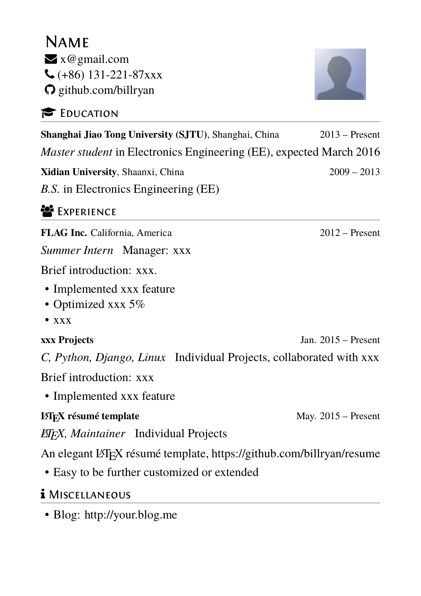
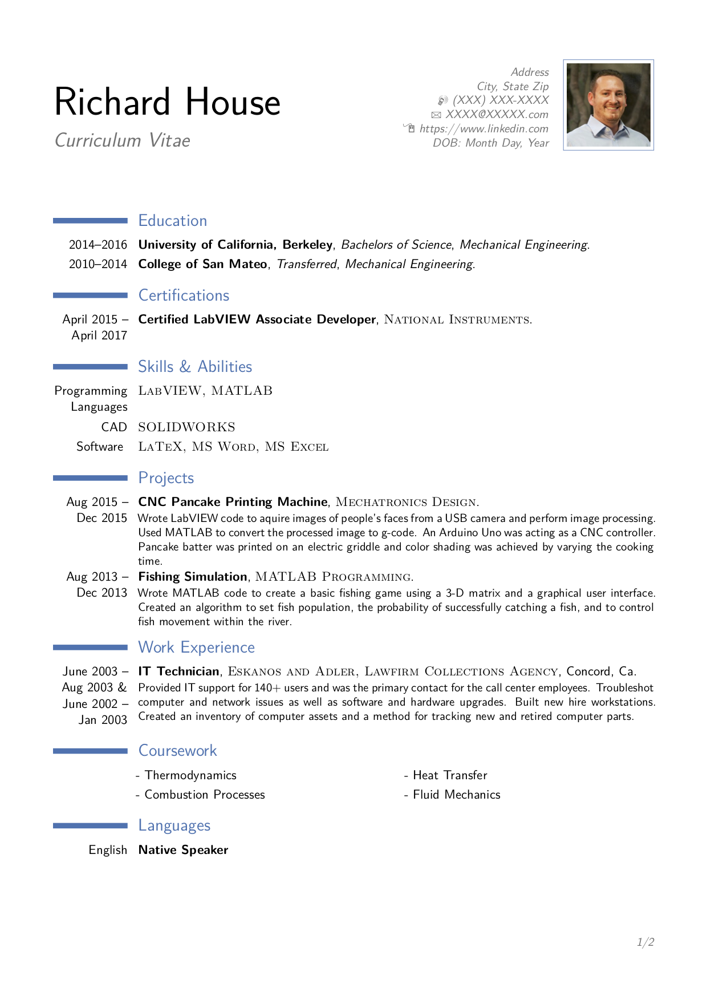
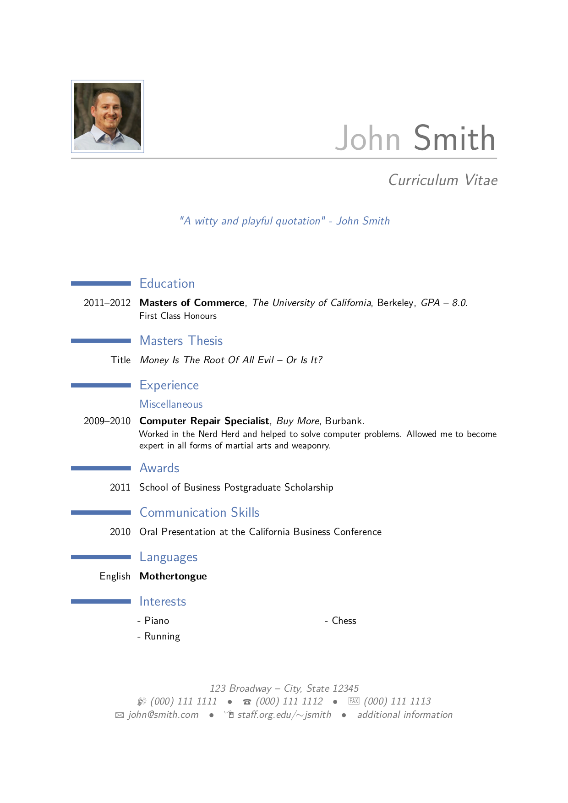

# Latex Resumes

There're some useful resume and CV templates.

## 1-resume2pages.tex

## 2-resume_cn.tex

## 3-resume_en.tex

## 4-resume.tex

## 5-resume_web.tex

## 6-resume_photo.tex

## 7-resume_pic.tex

## 8-resume-cn.tex

## 9-resume.tex

## 10-cv_4.tex

## 11-awesome_cv.tex

## Modern CV

### cv_7

### cv-2

